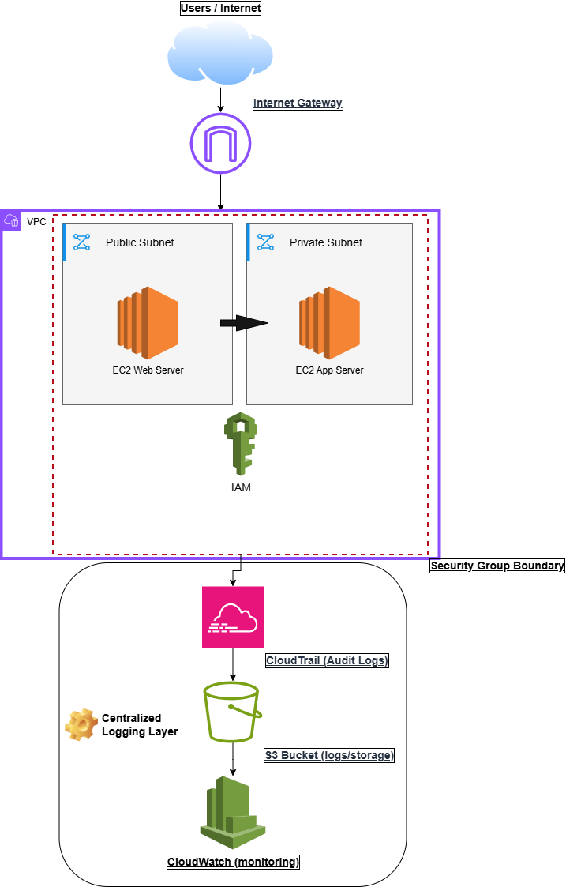
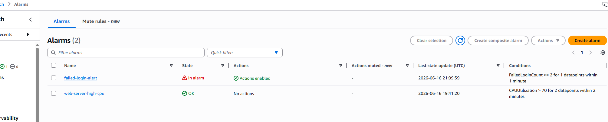
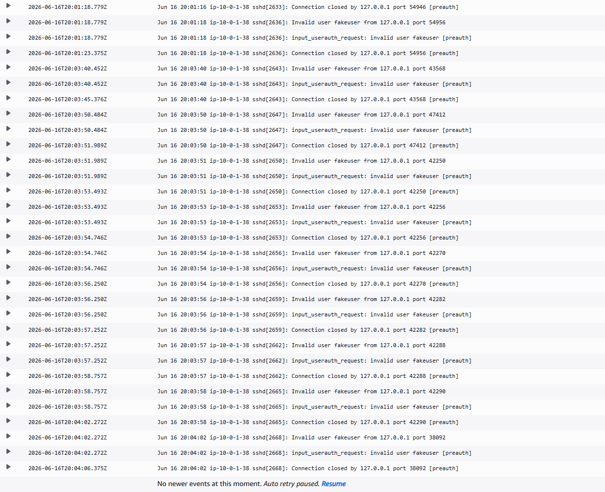
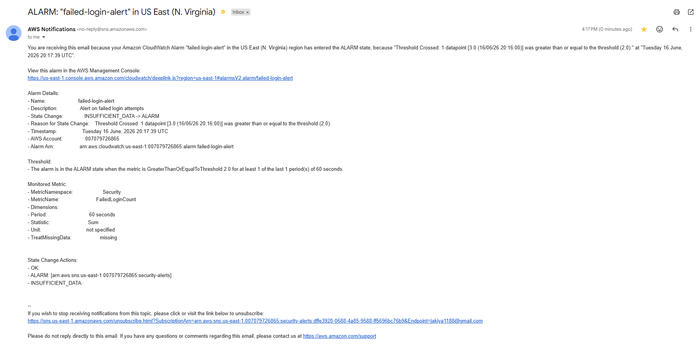
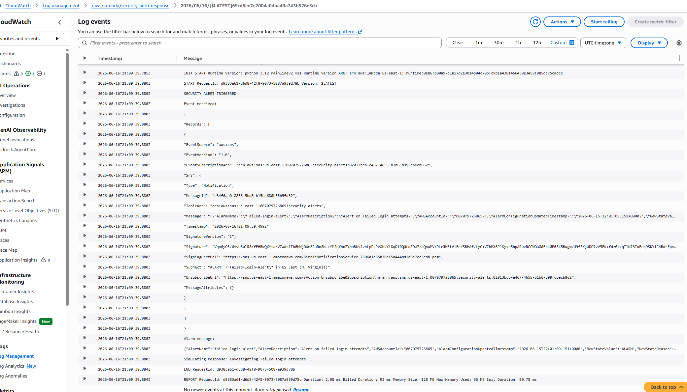

# AWS Cloud Security Platform

## Overview

Terraform-based AWS cloud security platform implementing Zero Trust access, threat detection, alerting, and automated incident response.

## Architecture

### Detection and Response Workflow

1. Failed login attempt occurs on EC2
2. CloudWatch Logs collect security events
3. Metric Filter identifies suspicious activity
4. CloudWatch Alarm triggers
5. SNS sends alert notification
6. Lambda executes automated response
7. Attacker IP is extracted and analyzed

## Features

- VPC with Public and Private Subnets
- EC2 Web Server and Application Server
- IAM Roles and SSM Access
- CloudWatch Monitoring
- Failed Login Detection
- SNS Email Alerting
- Lambda Auto-Response
- Attacker IP Extraction

## Technologies

- AWS
- Terraform
- Python
- CloudWatch
- SNS
- Lambda
- IAM
- Systems Manager

## Screenshots

### Cloudwatch Alarm

### Failed Login Detection

### SNS Alert Email

### Lambda Auto-Response

## Challenges Encountered

- CloudWatch Agent configuration
- Lambda event parsing
- SNS integration troubleshooting
- IAM permissions management

## Security Pipeline

Failed Login Attempt
        ↓
CloudWatch Logs
        ↓
Metric Filter
        ↓
CloudWatch Alarm
        ↓
SNS Email Notification
        ↓
Lambda Auto-Response
        ↓
Attacker IP Extraction

## Future Improvements

- Real-time CloudWatch log event processing
- AWS WAF integration
- Dynamic IP blocking
- Security dashboards
- Threat intelligence integration
- Automated incident response workflows
- Security event correlation across multiple hosts

## Lessons Learned

- Building modular Terraform infrastructure
- Implementing Zero Trust administrative access with AWS Systems Manager
- Configuring CloudWatch monitoring, logging, and detection
- Troubleshooting IAM permissions and service integrations
- Automating security responses using AWS Lambda
- Using Python regular expressions to extract attacker IP addresses
- Designing event-driven security workflows using Cloudwatch, SNS, and Lambda
